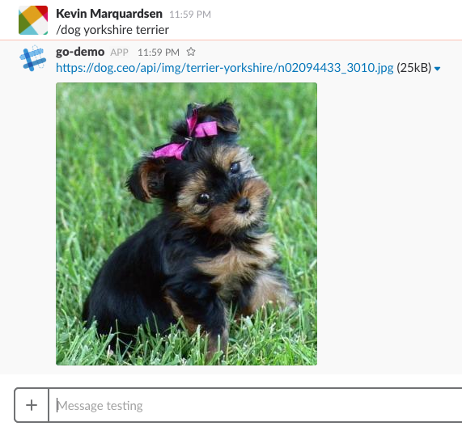

# sls-go-slack

Demo application using the Serverless framework and Go to build Slack Commands

Calls the public [dog api](https://dog.ceo/dog-api/) to post a random dog image for a given breed.

## Usage
1. `git clone git@github.com:mangatadigital/sls-go-slack.git`
2. `cp .env.example .env`
    * fill in and correct any of the variables in .env
    * replace WORKDIR in .env with /go/src/your-path/your-app
3. `make build deploy`